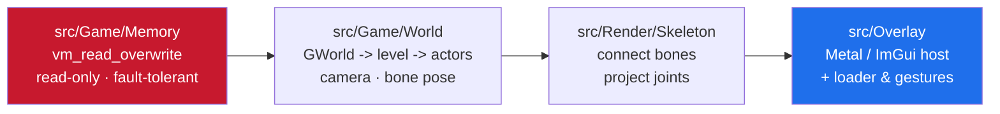

<h1 align="center">Reveal</h1>

<p align="center">a minimal skeleton ESP for UE4 games on iOS — draws a bone skeleton over the characters, and nothing else</p>

<p align="center">
  
  
  
  
  
</p>

---

Reveal draws a bone skeleton over the characters in the level and nothing else.
Small on purpose — the kind of codebase you can read start to finish in one sitting.

Metal + Dear ImGui, drawn in a transparent overlay. Built as a Theos tweak.

---

## how it works

Read the world, transform the bones, project, draw lines. That's the whole thing.



Four small pieces:

| piece | what it does |
|-------|--------------|
| [`src/Game/Memory`](src/Game/Memory) | reads the game through `vm_read_overwrite` — read-only and fault-tolerant; a bad pointer gives a failed read instead of a crash |
| [`src/Game/World`](src/Game/World) | walks the engine: `GWorld` to the level to the actor list, the local camera, and each character's bone pose straight out of the skeletal mesh |
| [`src/Render/Skeleton`](src/Render/Skeleton) | connects the bones into a figure and projects each joint to the screen |
| [`src/Overlay`](src/Overlay) | the Metal/ImGui host plus the loader that brings it up and wires the show/hide gestures |

---

## controls

| gesture | action |
|---------|--------|
| three-finger double tap | show the menu |
| two-finger double tap | hide it |

> Touches only reach the overlay while the menu is open, so the game stays playable
> otherwise.

---

## building

Needs [Theos](https://theos.dev) with `$THEOS` set.

```bash
make package
```

The `.deb` lands in `packages/`.

---

## porting it

Everything build-specific is in [`src/Game/Offsets.hpp`](src/Game/Offsets.hpp).
Point it at another build by updating the globals and the mesh/camera offsets there.
If the rig is renumbered, fix the bone pairs in
[`src/Render/Skeleton.cpp`](src/Render/Skeleton.cpp).

---

## notes

Read-only visual code. It doesn't write game memory, move the camera, or send
anything anywhere. Meant as a clean reference for how a UE4 iOS overlay fits
together.

MIT.

---

<p align="center">— shiedless</p>
